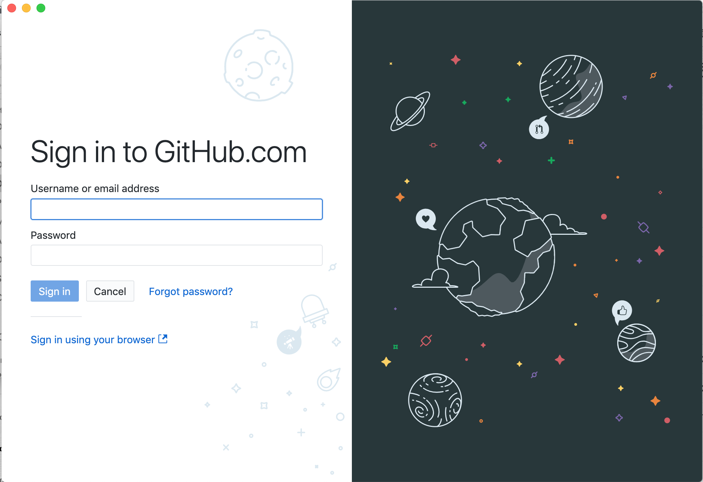
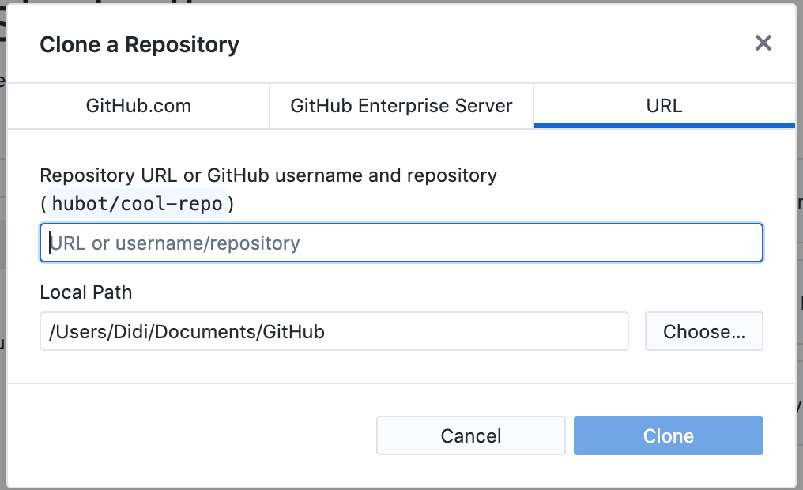
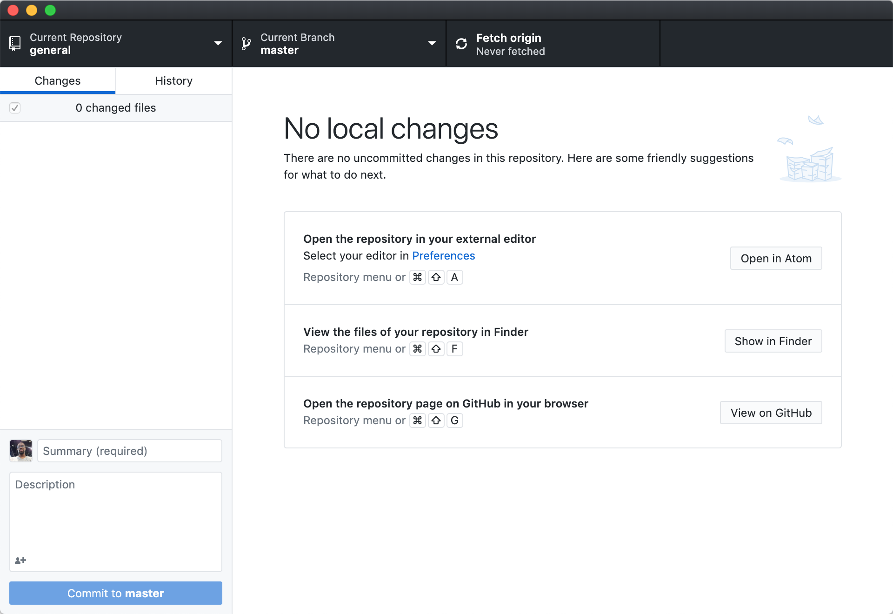
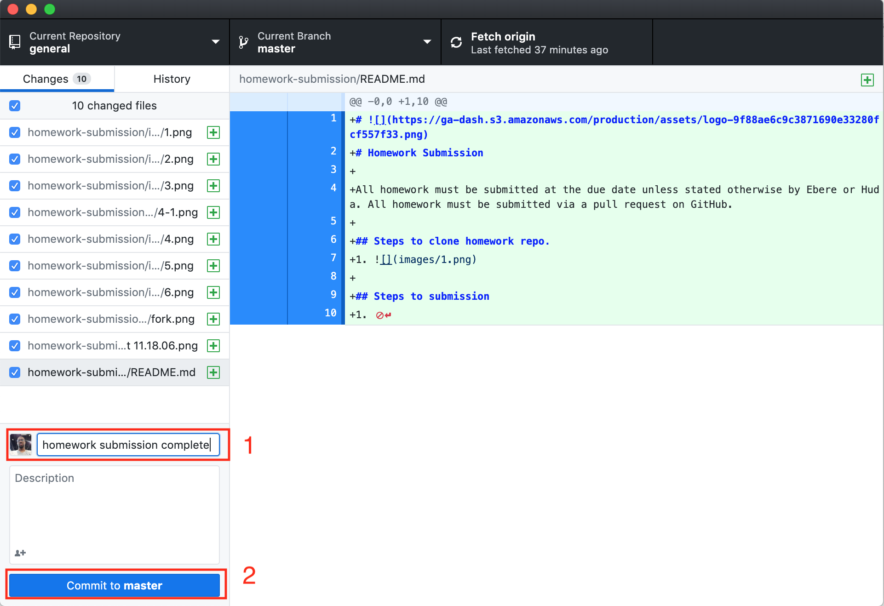
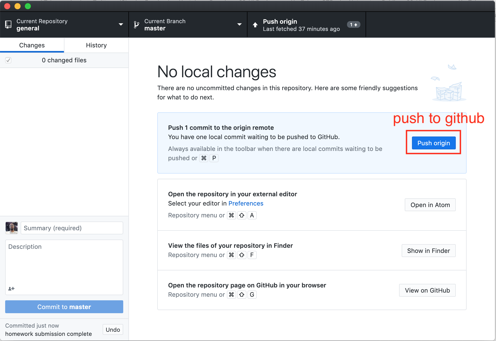
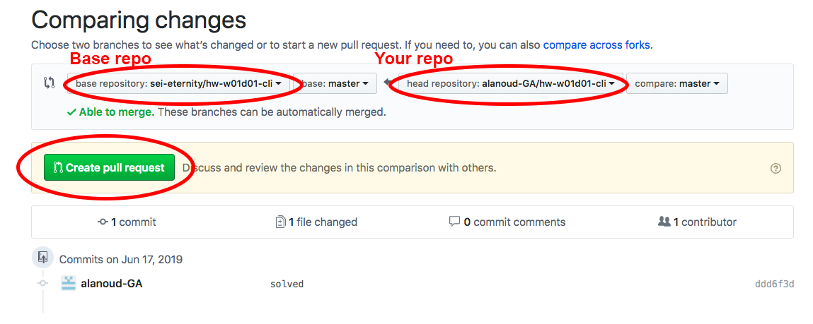
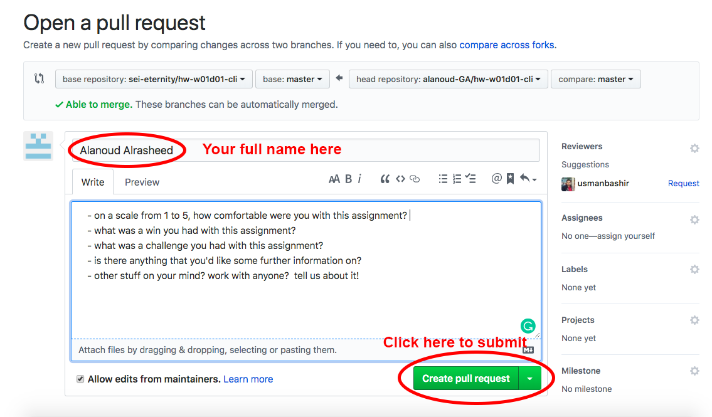

#  
# Homework Submission

All homework must be submitted at the due date unless stated otherwise by Ebere or Huda. All homework must be submitted via a pull request on GitHub.

## Setup GitHub Desktop
1. Download [Github Desktop](https://desktop.github.com) and Install 
1. Sign with GitHub account email and password.

## Steps to clone homework repo.
By now you should have GitHub Desktop properly setup on your local machine and you are `ready-to-roll!!`. 

Every week, you will receive a homework prompt to be sumbitted before the next lesson(unless state otherwise by Ebere or Huda). This homework `MUST` be `FORKED` and `CLONED` each time.

This is how to go about it: 

1. Visit the GitHub url for the homework prompt. 
2. Fork the repo (top right corner) and wait for the process to be completed.

When it is completed, it should look like the image below without the annotations:

3. Click `clone and download` and should popup a dropdown like `(3)` the copy the URL.
 > It is important to note the url should start with `https://...` 

4. Once the url is opened, go to the `GitHub Desktop` and click `Clone a Repository from the Internet...`

5. A window should pop up. Paste the copied URL into the `URL or username/repository` input field. Check to see if the local path is yoru prefered path and then click `Clone`

6. If its successful you should have a screen like this:

7. (Optional) change the editor `preferences` to VScode 

## Steps to submission
1. After completing the homework, go back to `GitHub Desktop`. You should see a view like the window with records of all your changes to the files you have modified.

2. Type a meaningful message title in the text box and also a description of what you did. Then click `commit to master`

3. After it done, click `push origin` and wait till its complete.

## Sending Pull Request
1. Visit your github repo to ensure the files have been updated. If they have been updated.
Click on  `New pull request`

2. Make sure the base repo is the original homework repo and your repo is yours. Then click `Create pull request`.

3. Fill out your submission. When submitting, include the following:
 * on a scale from 1 to 5, how comfortable were you with this assignment?
 * What was a win you had with this assignment?
 * What was a challenge you had with this assignment?
 * Is there anything that you'd like some further information on?
 * Other stuff on your mind? work with anyone? tell us about it!

4. Click Create Pull Request to submit your work!